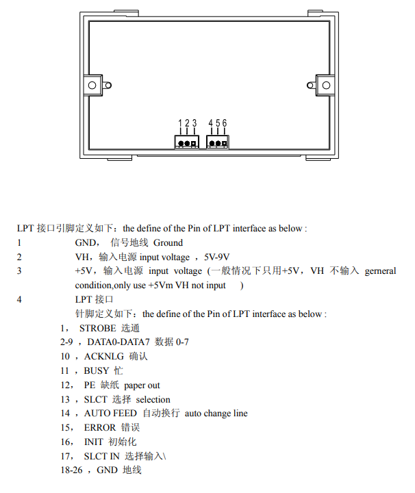

# Auto Grader

## Printer

### Background info

Baud rate: 19200

[datasheet](https://cdn-shop.adafruit.com/datasheets/A2-user+manual.pdf)



### Library

Original Adafruit Thermal Printer library found on github [Library source](https://os.mbed.com/components/Adafruit-Thermal-Printer/). This has been adapted to a more recent version of mbed (OS 6) and can be found in the `lib` folder. In the `main.cpp` file (in the `src` folder), the necessary functions are called to read the data that is received via the Raspberry Pi, and to send that data to the printer to be printed out.

To download the original library:

```commands
conda activate mbed
mbed import https://os.mbed.com/users/aross34/code/Thermal_HelloWorld/
```

OR

Download a zip file and place the files in a source folder with the rest of the code for the thermal printer.

### Printer setup via Nucleo

Connect the RX pin from the printer with pin D8 on the Nucleo, the TX pin with D2 on the Nucleo and the GND pin with a GND on the Nucleo. Power for the printer is best supplied via external power supply, not connected via the Nucleo or Pi. 5V and GND is needed for the power supply.

To program the printer to print the data received from the Nucleo (which has been received from the file on the Pi which links the devices):

```commands
conda activate mbed
mbed new .
mbed toolchain GCC_ARM
mbed target NUCLEO_L476RG
mbed compile -f
```

Once the Nucleo has been flashed, no further actions should be taken, except change the USB connection from the PC to the Pi. The rest goes via the input provided by the Pi.
The [main.cpp file](./src/main.cpp) contains the necessary commands to get the received characters, puts them into the buffer until a new line is detected, then prints the buffer and resets the buffer so new data can be read and printed again.
